# Enterprise Open Journal System (OJS) — Documentation Package

**Platform:** Custom Laravel 12 / PHP 8.4 Journal Publishing Management System
**Deployment Target:** Hostinger Shared Hosting (Business/Cloud plan, LiteSpeed + cPanel)
**Prepared for:** Software House Implementation Team
**Version:** 1.0

> ⚠️ **Hosting Constraint Notice (applies to the whole documentation set)**
> The original technology brief listed **Redis** and **Nginx**. Because the target environment is **Hostinger Shared Hosting** (no root access, no custom daemons, no persistent background processes, no Redis server, no Nginx — LiteSpeed/Apache only via cPanel), every chapter in this package has been adapted as follows:
>
> | Original Spec | Shared Hosting Replacement | Reason |
> |---|---|---|
> | Redis (cache) | **Database cache driver** (`cache` table) or **file cache driver** | No Redis extension/service on shared hosting |
> | Redis (queue) | **`database` queue driver**, processed via **cron-triggered `queue:work --stop-when-empty`** every minute (cPanel Cron Jobs) | No persistent worker process allowed |
> | Redis (session) | **`database` or `file` session driver** | Same reason |
> | Nginx | **LiteSpeed/Apache** with `.htaccess` (Laravel's default `public/.htaccess` is used as-is) | Hostinger uses LiteSpeed/Apache, not Nginx |
> | Supervisor (for queue workers) | **cPanel Cron Job** running `php artisan schedule:run` every minute, which in turn dispatches `queue:work --stop-when-empty --max-time=50` | Shared hosting forbids long-running/daemonized processes |
> | WebSockets / Reverb / Pusher (if later desired) | Deferred — polling-based in-app notifications (AJAX every 30–60s) recommended for MVP | No custom TCP ports open on shared hosting |
>
> All architecture, deployment, database, and DevOps chapters below already reflect this adapted stack. No further redesign is required before development starts.

---

## Document Map

This package is delivered as a set of companion files (all inside `ojs-docs/`). Each file consolidates several of the 50 originally requested document types into a coherent, implementation-ready chapter so the engineering team can work from a manageable number of references instead of 50 fragmented files.

| # | File | Original Chapters Covered |
|---|---|---|
| 00 | `00-Index-ExecutiveSummary-BRD-PRD.md` (this file) | 1 Executive Summary, 2 BRD, 3 PRD |
| 01 | `01-SRS-FSD-Requirements.md` | 4 FSD, 5 SRS, 23 Functional Requirements, 24 Non-Functional Requirements, 25 Business Rules, 26 Validation Rules |
| 02 | `02-System-Architecture-Hostinger.md` | 6 System Architecture, 18 Deployment Diagram, 19 Component Diagram, 49 Infrastructure Recommendation |
| 03 | `03-Database-Design-ERD-Dictionary.md` | 7 Database Design, 8 Complete ERD, 9 Database Dictionary |
| 04 | `04-Workflow-BPMN-UseCases.md` | 10 Workflow Diagram, 11 BPMN, 12 Use Case Diagram, 13 Use Case Specification, 14 Activity Diagram, 15 Sequence Diagram, 16 State Diagram, 17 Class Diagram |
| 05 | `05-PermissionMatrix-UserStories.md` | 20 Permission Matrix, 21 User Stories, 22 Acceptance Criteria |
| 06 | `06-API-Documentation.md` | 27 API Documentation |
| 07 | `07-Editorial-Review-Publication-Workflow.md` | 32 Editorial Workflow, 33 Review Workflow, 34 Publication Workflow |
| 08 | `08-Payment-Finance-Module.md` | 31 Finance Flow, 35 Payment Workflow |
| 09 | `09-CMS-Reporting-Dashboard.md` | 36 CMS Workflow, 37 Reporting Module, 38 Dashboard Specification, UI/UX screen specs |
| 10 | `10-Security-Audit-Notification.md` | 28 Notification Matrix, 29 Audit Matrix, 30 Security Design |
| 11 | `11-Testing-Strategy.md` | 39 Testing Strategy, 40 Unit Testing, 41 Integration Testing, 42 UAT, 43 Performance Testing |
| 12 | `12-Deployment-DevOps-Hostinger.md` | 44 Deployment Guide, 45 Backup & Recovery, 46 Disaster Recovery, 47 DevOps Architecture, 48 CI/CD Pipeline |
| 13 | `13-Future-Enhancement.md` | 50 Future Enhancement |

---

# Chapter 1 — Executive Summary

## 1.1 Introduction
This project delivers a from-scratch **Enterprise Open Journal System (OJS)** built on **Laravel 12 / PHP 8.4**, replicating and extending the capabilities of PKP OJS while adding enterprise features: multi-journal/multi-tenant readiness, RBAC, API-first architecture, manual-payment finance workflow, audit trail, and third-party scholarly indexing integrations (Crossref, DataCite, DOAJ, Garuda, SINTA, OAI-PMH).

## 1.2 Objectives
- Provide a self-hosted, fully-owned alternative to PKP OJS runnable on **shared hosting**.
- Support unlimited journals under one installation, each independently branded and configured.
- Digitize the entire publication lifecycle: submission → review → editorial decision → production → publication → indexing → reporting.
- Support **manual bank transfer** Article Processing Charge (APC) payments with finance verification, invoicing, and receipts — no payment gateway.
- Expose a complete **REST API** (Sanctum-secured, OpenAPI documented) for future mobile apps / integrations.
- Maintain full **audit trail** and **activity log** for compliance and accreditation (SINTA/DOAJ) audits.

## 1.3 Scope
In scope: author/reviewer/editor portals, multi-role backend, submission & peer review engine, editorial workflow, production workflow (copyediting/layout/proofreading), DOI/volume/issue publication, manual payment & finance module, CMS, reporting, notifications (Email + WhatsApp Fonnte), security & RBAC, REST API, OAuth (Google/ORCID), indexing integrations.

Out of scope (Phase 1): payment gateway integration, real-time WebSocket features, native mobile apps (API is provided for future use), machine-translation, AI-based plagiarism detection engine (integration hook only).

## 1.4 Stakeholders

| Stakeholder | Interest |
|---|---|
| Journal Publisher / Owner | Revenue (APC), reputation, indexing status |
| Journal Manager | Day-to-day journal configuration & operations |
| Editors (Managing/Section) | Editorial decision workflow efficiency |
| Reviewers | Simple, low-friction review experience |
| Authors | Transparent submission tracking, fast turnaround |
| Finance Team | Accurate, auditable payment verification |
| IT/DevOps | Maintainability on shared hosting, low ops burden |

## 1.5 Success Criteria
- End-to-end submission-to-publication workflow operable without manual DB intervention.
- 100% of financial transactions auditable (who verified, when, proof attached).
- All roles restricted strictly per Permission Matrix (Chapter 05).
- API coverage for all core resources with Sanctum auth and rate limiting.
- Deployable on Hostinger Business/Cloud hosting without SSH daemon requirements (cron-only).

---

# Chapter 2 — Business Requirement Document (BRD)

## 2.1 Business Context
Academic publishers/universities need an in-house, fully controlled journal management platform to avoid PKP OJS licensing/hosting limitations, enable custom branding per journal, and integrate local payment habits (Indonesian bank transfer) and local notification channels (WhatsApp via Fonnte).

## 2.2 Business Goals
1. Reduce manual editorial administration by ≥ 70% via workflow automation.
2. Achieve DOAJ/SINTA/Garuda compliance metadata export (OAI-PMH) from day one.
3. Enable finance team to verify APC payments within a defined SLA (e.g., 1×24h).
4. Support growth to unlimited journals without re-architecture ("multi-tenant ready" at the application/data level, single shared-hosting-friendly database).

## 2.3 Business Process Overview (high level)

```mermaid
flowchart LR
    A[Author Registration] --> B[Article Submission]
    B --> C[Initial Editorial Screening]
    C --> D{APC Applicable?}
    D -- Yes --> E[Invoice Generated]
    E --> F[Manual Bank Transfer]
    F --> G[Upload Payment Proof]
    G --> H[Finance Verification]
    H -- Approved --> I[Editor Assignment]
    D -- No --> I
    I --> J[Reviewer Assignment]
    J --> K[Peer Review]
    K --> L{Decision}
    L -- Revision --> M[Author Revision]
    M --> K
    L -- Reject --> Z[Rejected / Archived]
    L -- Accept --> N[Copy Editing]
    N --> O[Layout Editing]
    O --> P[Proofreading]
    P --> Q[DOI Assignment]
    Q --> R[Volume & Issue Assignment]
    R --> S[Publication]
    S --> T[Indexing]
    T --> U[Archiving & Reporting]
```

## 2.4 Business Rules Summary
See Chapter 25 (Business Rules) in `01-SRS-FSD-Requirements.md` for the full enumerated rule set (BR-001…BR-0NN). Key highlights:
- BR-001: A submission cannot proceed to Reviewer Assignment while an unpaid **mandatory** APC invoice is `waiting_verification` or `waiting_payment`, unless waived/discounted by authorized role.
- BR-002: Revision cycles are **unlimited**; each cycle creates a new **submission version** with immutable history.
- BR-003: A Reviewer's identity is hidden from the Author under Single/Double Blind; visible under Open Review.
- BR-004: DOI can only be assigned once per article version and is immutable once registered with DataCite/Crossref.
- BR-005: Every state-changing action on Submission, Payment, and User records must write an Audit Trail entry (actor, timestamp, before/after, IP, module).

## 2.5 Assumptions & Constraints
- Hosting: Hostinger shared/cloud hosting — no Redis, no Nginx, no root SSH daemons, cron granularity = 1 minute minimum.
- Single MySQL database shared by all journals ("multi-tenant ready" = journal_id scoping, not separate DB-per-tenant, to remain shared-hosting compatible).
- Storage: local disk by default; S3-compatible driver available and toggled via `.env` when the client upgrades storage.
- Virus scanning is "ready" (interface + queued job stub) since ClamAV daemon is typically unavailable on shared hosting; can be enabled if client upgrades to VPS.

## 2.6 Risks

| Risk | Impact | Mitigation |
|---|---|---|
| Shared hosting CPU/memory limits under load | Slow queue processing | Chunked cron-based queue worker, indexed queries, cache tables |
| Cron granularity (1 min) delays "real-time" feel | Notification/queue delay up to ~60s | Set expectations; batch dispatch, use `queue:work --stop-when-empty` |
| No WebSocket support | No live push notifications | AJAX polling every 30–60s for in-app notification bell |
| Large file uploads (datasets) | PHP `upload_max_filesize`/`post_max_size` limits on shared hosting | Chunked upload (resumable.js) + admin-configurable limits, document limits in FSD |

---

# Chapter 3 — Product Requirement Document (PRD)

## 3.1 Product Vision
"A single Laravel installation that lets a university or publisher run unlimited peer-reviewed journals — from author submission to DOAJ-indexed publication — entirely on affordable shared hosting, with zero payment-gateway dependency and full auditability."

## 3.2 Target Users
Guest/Reader, Subscriber, Author, Co-Author, Reviewer, Institution User (frontend); Super Admin, System Admin, Journal Manager, Managing Editor, Section Editor, Reviewer, Copy Editor, Layout Editor, Proofreader, Publisher, Finance, Marketing, Customer Service, Support (backend). Full matrix in Chapter 05.

## 3.3 Feature Modules (Product Backlog Epics)

| Epic | Description |
|---|---|
| EPIC-01 Identity & Access | Registration, Google/ORCID OAuth, RBAC, multi-guard, 2FA-ready, session/device management |
| EPIC-02 Journal Management | Multi-journal config: ISSN/eISSN/DOI prefix, board, schedule, APC, bank account, theme, SEO |
| EPIC-03 Submission | Metadata, files, versioning, validation, draft, withdraw, resubmit |
| EPIC-04 Peer Review | Blind modes, assignment, rubric/score, rounds, reminders/escalation |
| EPIC-05 Editorial Workflow | Screening, decisions, revision management |
| EPIC-06 Production | Copyediting, layout, proofreading |
| EPIC-07 Publication | Volume/Issue, DOI, formats (PDF/HTML/XML/EPUB), Crossmark |
| EPIC-08 Finance | Invoice, manual payment, proof upload, verification, receipt, waivers/discounts |
| EPIC-09 CMS | Landing, announcements, guidelines, policies, menu/banner/footer, SEO |
| EPIC-10 Reporting | Submission/publication/revenue/performance reports, export |
| EPIC-11 Notification | Email, WhatsApp (Fonnte), in-app |
| EPIC-12 Security & Audit | RBAC, audit trail, activity/login/device logs, rate limiting |
| EPIC-13 Integrations | Crossref, DataCite, DOAJ, OAI-PMH, OpenAIRE, Garuda, SINTA, S3, Google/ORCID OAuth |
| EPIC-14 API Platform | Sanctum REST API, OpenAPI/Swagger docs |

## 3.4 Release Plan (recommended phasing)

| Phase | Content |
|---|---|
| Phase 1 (MVP) | EPIC-01, 02, 03, 05, 06, 07 (core editorial-to-publication), basic CMS |
| Phase 2 | EPIC-04 full peer review, EPIC-08 Finance (manual payment) |
| Phase 3 | EPIC-10 Reporting, EPIC-11 Notification, EPIC-12 hardening |
| Phase 4 | EPIC-13 Integrations (Crossref/DataCite/OAI-PMH/DOAJ), EPIC-14 full API + Swagger |

## 3.5 Non-Goals
No payment gateway, no native mobile app in Phase 1–4 (API-ready only), no AI plagiarism engine build (only integration hook), no multi-database-per-tenant isolation.

## 3.6 KPIs
- Average time-to-first-decision (days)
- Acceptance rate per journal
- APC verification SLA compliance %
- Reviewer response rate
- System uptime on shared hosting (target 99.5%)

---
*Continue to `01-SRS-FSD-Requirements.md` for detailed functional/non-functional specifications.*
