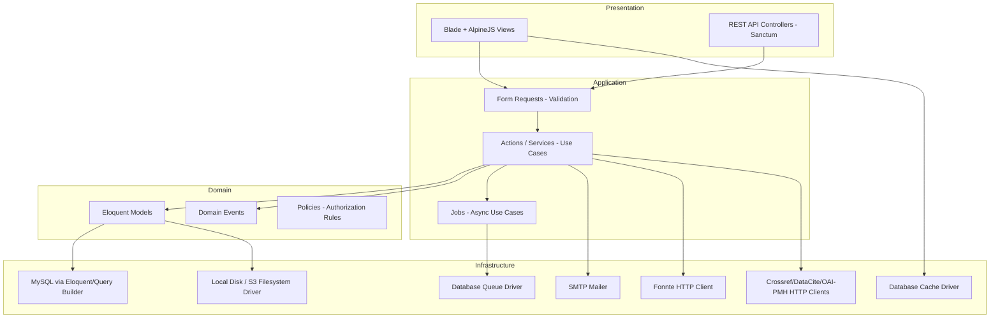
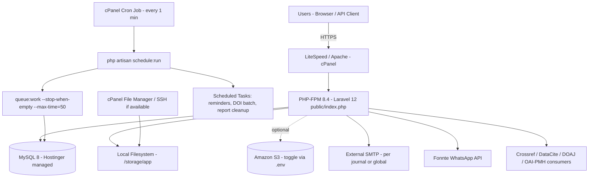
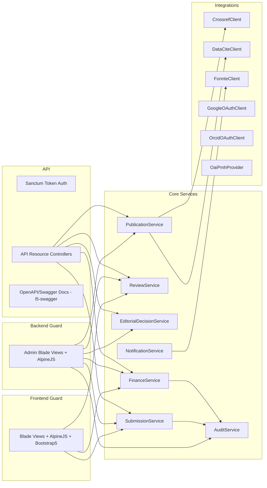

# Chapter 6, 18, 19, 49 — System Architecture, Deployment Diagram, Component Diagram, Infrastructure Recommendation

## Introduction
Defines the technical architecture of the OJS platform, specifically adapted to run on **Hostinger shared/cloud hosting** (no Redis, no Nginx, no root/daemon access).

## Objectives
- Modular, Clean-Architecture-inspired Laravel structure.
- Zero dependency on services unavailable on shared hosting.
- Clear upgrade path to VPS/Redis/Nginx later without code rewrites.

## Scope
Application layering, module boundaries, deployment topology, infrastructure sizing recommendation.

---

## 6.1 Architecture Style
**Modular Monolith** (not microservices — inappropriate for shared hosting): a single Laravel 12 codebase organized into **domain modules**, each with its own routes, controllers, models, services, policies, and events, communicating internally via Laravel's Event/Listener bus (event-driven where useful) and Service classes (direct calls otherwise). This gives "Clean Architecture" separation without the operational overhead microservices would require on shared hosting.

### Layering (Clean Architecture mapping)



## 6.2 Module Breakdown (folder-per-domain under `app/Modules`)

| Module | Responsibility |
|---|---|
| `Identity` | Auth, OAuth (Google/ORCID), RBAC (Spatie Permission), 2FA, sessions, login history |
| `Journal` | Journal CRUD, settings, bank accounts, editorial board, SMTP overrides |
| `Submission` | Submission CRUD, versioning, file management, metadata |
| `Review` | Reviewer assignment, rubric, scoring, rounds, reminders |
| `Editorial` | Screening, decisions, revision management |
| `Production` | Copyediting, layout, proofreading, galley generation |
| `Publication` | Volume/Issue, DOI, formats, Crossmark, archive/search |
| `Finance` | Invoice, payment proof, verification, receipt, waiver/discount, refund |
| `CMS` | Pages, announcements, news, menus, banners, SEO |
| `Reporting` | Aggregation queries, export jobs (Excel/CSV/PDF) |
| `Notification` | Channel drivers (Mail, Fonnte, In-App), event listeners, preference management |
| `Security` | Audit trail, activity log, rate limiting policies |
| `Integration` | Crossref, DataCite, OAI-PMH, DOAJ, OpenAIRE, Garuda/SINTA export adapters |
| `Api` | Sanctum-protected REST resource controllers, API Resources (transformers), OpenAPI annotations |

Each module follows:
```
app/Modules/Submission/
 ├─ Http/Controllers/
 ├─ Http/Requests/
 ├─ Models/
 ├─ Policies/
 ├─ Services/              (business logic / use cases)
 ├─ Actions/                (single-purpose invokable classes)
 ├─ Events/ Listeners/
 ├─ Jobs/
 ├─ Notifications/
 └─ routes.php
```

## 6.3 Deployment Diagram (Hostinger Shared/Cloud Hosting)



### Key Hostinger-specific decisions
1. **Web server**: LiteSpeed (Hostinger's default) or Apache — both read Laravel's `public/.htaccess` out of the box. No Nginx config needed.
2. **Document root**: point domain/subdomain to `public/` (Hostinger cPanel → "Manage" → set document root, or symlink trick if root change isn't available: keep `index.php` + `.htaccess` redirect at account root pointing into `public/`).
3. **Queue**: `QUEUE_CONNECTION=database`. A single cPanel Cron Job runs every minute:
   `* * * * * php /home/USER/domains/yourapp.com/artisan schedule:run >> /dev/null 2>&1`
   Laravel's scheduler (in `routes/console.php` / `app/Console/Kernel.php` equivalent for L12) triggers `queue:work --stop-when-empty --max-time=50 --tries=3` so it never runs longer than the cron interval — avoiding orphaned long-running processes that shared hosting disallows.
4. **Cache/session/queue**: all use the `database` driver (tables: `cache`, `sessions`, `jobs`, `failed_jobs`). No Redis extension required.
5. **Storage**: `local` disk (`storage/app/public` symlinked to `public/storage` via `php artisan storage:link`) by default; `s3` driver pre-wired (using `league/flysystem-aws-s3-v3`) and switched on purely via `.env` (`FILESYSTEM_DISK=s3`) when the client is ready to offload storage.
6. **SSL**: Hostinger free AutoSSL (Let's Encrypt) via cPanel — force HTTPS via `.htaccess` redirect + `URL::forceScheme('https')` in `AppServiceProvider`.
7. **PHP execution limits**: Hostinger shared plans typically cap `max_execution_time` (~60–300s) and memory (~256–512MB). All heavy operations (report export, bulk DOI registration, WhatsApp blast) MUST be dispatched to the queue, never run inline in a controller.
8. **No Supervisor/systemd**: queue "worker" is not a persistent process; it is cron-triggered, batch-draining `database` jobs table every minute. Documented explicitly in `12-Deployment-DevOps-Hostinger.md`.

## 6.4 Component Diagram



## 6.5 Technology Stack (final, adjusted)

| Layer | Technology |
|---|---|
| Language/Framework | PHP 8.4, Laravel 12 |
| Database | MySQL 8.0 (Hostinger managed instance) |
| Cache | **Database cache driver** (upgrade path: Redis) |
| Queue | **Database queue driver + cron worker** (upgrade path: Redis + Supervisor) |
| Session | **Database session driver** |
| Web/App Server | LiteSpeed / Apache (Hostinger managed) — **not Nginx** |
| Frontend | Blade, Bootstrap 5, AlpineJS |
| API Auth | Laravel Sanctum |
| OAuth | Socialite (Google), custom ORCID OAuth2 client |
| Storage | Local disk (default) / Amazon S3 (flysystem-s3, `.env` toggle) |
| Mail | SMTP (per-journal override, global fallback) via Laravel Mail |
| WhatsApp | Fonnte HTTP API (Guzzle client) |
| PDF Generation | `barryvdh/laravel-dompdf` or `spatie/laravel-pdf` (browsershot-free, since shared hosting lacks headless Chrome — **use dompdf**, not Puppeteer/Browsershot) |
| Excel/CSV Export | `maatwebsite/excel` |
| API Docs | `darkaonline/l5-swagger` (OpenAPI 3) |
| Activity/Audit | `spatie/laravel-activitylog` + custom `AuditTrail` model |
| RBAC | `spatie/laravel-permission` |
| QR Code | `simplesoftwareio/simple-qrcode` |
| Testing | PHPUnit / Pest, Laravel Dusk optional (browser tests — resource-heavy, run in CI not on shared hosting) |

## 6.6 Why NOT Redis/Nginx here (explicit rationale)
- **Redis** requires a running daemon + PHP `redis`/`predis` extension typically unavailable or unmanaged on shared hosting; Laravel's `database` cache/queue drivers are functionally equivalent for this workload (moderate traffic, not sub-millisecond cache requirements) and require zero extra services.
- **Nginx** is a web-server choice controlled entirely by the hosting provider; Hostinger shared/cloud hosting serves via **LiteSpeed** (Apache-compatible `.htaccess`). Laravel is server-agnostic — no application code changes are needed either way, only documentation/deployment steps differ (this is reflected in Chapter 12).

## 6.7 Recommended Hostinger Plan
- **Business or Cloud Startup hosting** (not the entry "Premium" plan) for headroom on cron jobs, MySQL connections, and storage quota.
- PHP 8.4 selected via cPanel "Select PHP Version".
- Enable extensions: `pdo_mysql`, `mbstring`, `openssl`, `curl`, `gd` or `imagick`, `zip`, `fileinfo`, `bcmath`, `intl` (all standard on Hostinger PHP builds).
- If traffic grows beyond shared-hosting ceiling → migrate to Hostinger **VPS** or Cloud plan with SSH root access → re-enable Redis + Supervisor + optionally Nginx without code changes (only `.env` + deployment script changes).

---
*Continue to `03-Database-Design-ERD-Dictionary.md`.*
