# Chapter 7–9 — Database Design, Complete ERD, Database Dictionary

## Introduction
Full relational schema for the OJS platform on **MySQL 8.0**, designed for a **single shared database** (multi-journal via `journal_id` scoping — appropriate for shared hosting, avoids per-tenant DB overhead).

## Objectives
Provide a normalized (3NF, selectively denormalized only for reporting cache tables), fully-keyed schema ready for Laravel migrations.

## Conventions
- Primary key: `id BIGINT UNSIGNED AUTO_INCREMENT` **plus** `uuid CHAR(36) UNIQUE` on all business-facing tables (external references use UUID, internal joins use BIGINT for performance/index size — best practice on shared MySQL where UUID-only PKs fragment InnoDB indexes).
- All tables: `created_at`, `updated_at`; soft-deletable tables also add `deleted_at`.
- Audit columns on transactional tables: `created_by`, `updated_by` (nullable FK to `users.id`).
- Status fields: MySQL `ENUM` avoided in favor of short `VARCHAR` + application-level enum class (easier migration/rollback) — documented per table.
- Money columns: `DECIMAL(15,2)`, currency `CHAR(3)` (ISO 4217, default `IDR`).
- All FKs indexed; composite indexes documented per table.

---

## 7.1 Complete ERD (core entities)

```mermaid
erDiagram
    USERS ||--o{ JOURNAL_USER : has
    JOURNALS ||--o{ JOURNAL_USER : has
    JOURNALS ||--o{ SUBMISSIONS : owns
    JOURNALS ||--o{ VOLUMES : owns
    JOURNALS ||--o{ BANK_ACCOUNTS : owns
    JOURNALS ||--o{ APC_FEES : owns
    JOURNALS ||--o{ CMS_PAGES : owns
    JOURNALS ||--o{ ANNOUNCEMENTS : owns

    USERS ||--o{ SUBMISSION_AUTHORS : is
    SUBMISSIONS ||--o{ SUBMISSION_AUTHORS : has
    SUBMISSIONS ||--o{ SUBMISSION_VERSIONS : has
    SUBMISSION_VERSIONS ||--o{ SUBMISSION_FILES : has
    SUBMISSIONS ||--o{ REVIEW_ROUNDS : has
    REVIEW_ROUNDS ||--o{ REVIEW_ASSIGNMENTS : has
    USERS ||--o{ REVIEW_ASSIGNMENTS : reviews
    REVIEW_ASSIGNMENTS ||--o{ REVIEW_RESPONSES : produces
    SUBMISSIONS ||--o{ EDITORIAL_DECISIONS : has
    USERS ||--o{ EDITORIAL_DECISIONS : decides

    SUBMISSIONS ||--o{ INVOICES : billed
    INVOICES ||--o{ PAYMENTS : receives
    PAYMENTS ||--o{ PAYMENT_PROOFS : has
    INVOICES ||--o{ RECEIPTS : generates

    SUBMISSIONS ||--o{ PRODUCTION_TASKS : has
    SUBMISSIONS ||--o| ARTICLES : becomes
    VOLUMES ||--o{ ISSUES : has
    ISSUES ||--o{ ARTICLES : contains
    ARTICLES ||--o{ ARTICLE_GALLEYS : has
    ARTICLES ||--o{ ARTICLE_DOIS : has

    USERS ||--o{ AUDIT_TRAILS : performs
    USERS ||--o{ ACTIVITY_LOGS : performs
    USERS ||--o{ LOGIN_HISTORIES : has
    USERS ||--o{ NOTIFICATIONS : receives

    ROLES ||--o{ MODEL_HAS_ROLES : assigned
    PERMISSIONS ||--o{ ROLE_HAS_PERMISSIONS : grants
    ROLES ||--o{ ROLE_HAS_PERMISSIONS : has
```

## 7.2 Full Table List (grouped)

**Master/Reference:** `users`, `roles`, `permissions`, `journals`, `bank_accounts`, `apc_fees`, `countries`, `institutions`, `licenses`, `system_settings`

**Relationship/Pivot:** `journal_user`, `model_has_roles`, `model_has_permissions`, `role_has_permissions`, `submission_authors`, `submission_editors`

**Transaction:** `submissions`, `submission_versions`, `submission_files`, `review_rounds`, `review_assignments`, `review_responses`, `editorial_decisions`, `production_tasks`, `invoices`, `payments`, `payment_proofs`, `receipts`, `refunds`

**Publication:** `volumes`, `issues`, `articles`, `article_galleys`, `article_dois`, `article_views`, `article_downloads`, `citations`

**CMS:** `cms_pages`, `announcements`, `news`, `menus`, `menu_items`, `banners`, `faqs`

**System/Log:** `audit_trails`, `activity_logs`, `login_histories`, `device_histories`, `notifications`, `notification_preferences`, `jobs`, `failed_jobs`, `cache`, `sessions`

---

## 7.3 Database Dictionary (key tables — representative full detail; remaining tables follow the same pattern)

### Table: `users`
**Purpose:** Unified account table for all frontend and backend roles (RBAC differentiates behavior, not table structure) — recommended for shared-hosting simplicity over multi-guard multi-table split.

| Column | Type | Constraints | Description |
|---|---|---|---|
| id | BIGINT UNSIGNED | PK, AI | Internal ID |
| uuid | CHAR(36) | UNIQUE, NOT NULL | Public reference |
| name | VARCHAR(150) | NOT NULL | Full name |
| email | VARCHAR(191) | UNIQUE, NOT NULL | Login/contact |
| email_verified_at | TIMESTAMP | NULL | |
| password | VARCHAR(255) | NULL | Nullable for OAuth-only accounts |
| google_id | VARCHAR(100) | NULL, UNIQUE | Google OAuth subject |
| orcid_id | VARCHAR(19) | NULL, UNIQUE | Format `0000-0000-0000-000X` |
| affiliation | VARCHAR(255) | NULL | Institution name (free text) |
| institution_id | BIGINT UNSIGNED | FK → institutions.id, NULL | Linked institution |
| research_interest | TEXT | NULL | |
| scopus_id | VARCHAR(50) | NULL | |
| researchgate_url | VARCHAR(255) | NULL | |
| google_scholar_url | VARCHAR(255) | NULL | |
| cv_file_path | VARCHAR(255) | NULL | |
| phone | VARCHAR(30) | NULL | For WhatsApp/Fonnte |
| avatar_path | VARCHAR(255) | NULL | |
| status | VARCHAR(20) | DEFAULT 'active' | active, suspended, banned |
| two_factor_enabled | BOOLEAN | DEFAULT false | |
| two_factor_secret | TEXT | NULL, encrypted | |
| password_changed_at | TIMESTAMP | NULL | For password policy |
| created_by / updated_by | BIGINT UNSIGNED | NULL, FK → users.id | |
| created_at / updated_at / deleted_at | TIMESTAMP | | Soft delete enabled |

**Indexes:** `email` (unique), `orcid_id` (unique), `google_id` (unique), `institution_id`, `status`.
**Sample data:** `{name:"Dr. Siti Rahma", email:"siti@univ.ac.id", orcid_id:"0000-0002-1825-0097", status:"active"}`

---

### Table: `journals`
**Purpose:** Master record for each managed journal (multi-journal core table).

| Column | Type | Constraints | Description |
|---|---|---|---|
| id | BIGINT UNSIGNED | PK, AI | |
| uuid | CHAR(36) | UNIQUE | |
| name | VARCHAR(255) | NOT NULL | |
| slug | VARCHAR(255) | UNIQUE, NOT NULL | URL segment |
| issn | VARCHAR(9) | NULL, UNIQUE | Print ISSN format `NNNN-NNNN` |
| eissn | VARCHAR(9) | NULL, UNIQUE | Online ISSN |
| doi_prefix | VARCHAR(20) | NULL | e.g., `10.12345` |
| description | TEXT | NULL | |
| focus_and_scope | TEXT | NULL | |
| logo_path | VARCHAR(255) | NULL | |
| theme_color | VARCHAR(7) | NULL | hex |
| smtp_config | JSON | NULL | encrypted per-journal SMTP override |
| seo_meta | JSON | NULL | title/description/og_image |
| apc_default_amount | DECIMAL(15,2) | DEFAULT 0 | |
| apc_currency | CHAR(3) | DEFAULT 'IDR' | |
| status | VARCHAR(20) | DEFAULT 'draft' | draft, active, suspended, archived |
| publication_schedule | VARCHAR(50) | NULL | e.g., "quarterly", "biannual" |
| created_by / updated_by | BIGINT UNSIGNED | NULL | |
| created_at / updated_at / deleted_at | TIMESTAMP | | |

**Indexes:** `slug` (unique), `issn`, `eissn`, `status`.

---

### Table: `journal_user` (pivot — scoped role assignment)

| Column | Type | Constraints | Description |
|---|---|---|---|
| id | BIGINT UNSIGNED | PK | |
| journal_id | BIGINT UNSIGNED | FK → journals.id | |
| user_id | BIGINT UNSIGNED | FK → users.id | |
| role | VARCHAR(50) | NOT NULL | denormalized role label (also mirrored in Spatie `model_has_roles` with team scoping) |
| is_primary | BOOLEAN | DEFAULT false | primary journal assignment for the user |
| created_at / updated_at | TIMESTAMP | | |

**Indexes:** unique composite `(journal_id, user_id, role)`.

---

### Table: `submissions`

| Column | Type | Constraints | Description |
|---|---|---|---|
| id | BIGINT UNSIGNED | PK | |
| uuid | CHAR(36) | UNIQUE | |
| journal_id | BIGINT UNSIGNED | FK → journals.id | |
| tracking_code | VARCHAR(30) | UNIQUE | e.g., `JRN-2026-000123` |
| parent_submission_id | BIGINT UNSIGNED | NULL, FK → submissions.id | For resubmissions |
| title | VARCHAR(500) | NOT NULL | |
| abstract | TEXT | NOT NULL | |
| keywords | JSON | NOT NULL | array of strings |
| language | VARCHAR(5) | DEFAULT 'en' | |
| section | VARCHAR(100) | NULL | journal section/category |
| funding_statement | TEXT | NULL | |
| conflict_of_interest | TEXT | NULL | |
| ethics_statement | TEXT | NULL | |
| acknowledgement | TEXT | NULL | |
| license | VARCHAR(30) | NOT NULL | |
| status | VARCHAR(30) | NOT NULL, DEFAULT 'draft' | see State Diagram in Ch.04 |
| current_stage | VARCHAR(30) | NOT NULL | screening/review/revision/production/published/rejected/withdrawn |
| submitted_at | TIMESTAMP | NULL | |
| created_by / updated_by | BIGINT UNSIGNED | NULL | |
| created_at / updated_at / deleted_at | TIMESTAMP | | |

**Indexes:** `tracking_code` unique, `journal_id`, `status`, `current_stage`, `parent_submission_id`.

---

### Table: `submission_versions`

| Column | Type | Constraints | Description |
|---|---|---|---|
| id | BIGINT UNSIGNED | PK | |
| submission_id | BIGINT UNSIGNED | FK → submissions.id | |
| version_number | INT | NOT NULL | sequential per submission |
| revision_round_id | BIGINT UNSIGNED | NULL, FK → review_rounds.id | which round triggered this version |
| response_to_reviewers_path | VARCHAR(255) | NULL | |
| created_by | BIGINT UNSIGNED | NOT NULL | |
| created_at | TIMESTAMP | | Immutable — no updated_at (append-only) |

**Indexes:** composite unique `(submission_id, version_number)`.

---

### Table: `submission_files`

| Column | Type | Constraints | Description |
|---|---|---|---|
| id | BIGINT UNSIGNED | PK | |
| submission_version_id | BIGINT UNSIGNED | FK → submission_versions.id | |
| file_category | VARCHAR(30) | NOT NULL | manuscript, supplementary, dataset, ethical_clearance, copyright_form, revision |
| original_filename | VARCHAR(255) | NOT NULL | |
| stored_path | VARCHAR(500) | NOT NULL | UUID-based path |
| disk | VARCHAR(20) | DEFAULT 'local' | local / s3 |
| mime_type | VARCHAR(100) | NOT NULL | |
| size_bytes | BIGINT UNSIGNED | NOT NULL | |
| checksum_sha256 | CHAR(64) | NOT NULL | integrity verification |
| virus_scan_status | VARCHAR(20) | DEFAULT 'pending' | pending/clean/infected/skipped |
| uploaded_by | BIGINT UNSIGNED | NOT NULL | |
| created_at / deleted_at | TIMESTAMP | | |

**Indexes:** `submission_version_id`, `file_category`.

---

### Table: `review_rounds`

| Column | Type | Constraints | Description |
|---|---|---|---|
| id | BIGINT UNSIGNED | PK | |
| submission_id | BIGINT UNSIGNED | FK | |
| round_number | INT | NOT NULL | |
| blind_mode | VARCHAR(20) | NOT NULL | single_blind, double_blind, open |
| status | VARCHAR(20) | DEFAULT 'open' | open, closed |
| opened_at / closed_at | TIMESTAMP | NULL | |

**Indexes:** composite unique `(submission_id, round_number)`.

---

### Table: `review_assignments`

| Column | Type | Constraints | Description |
|---|---|---|---|
| id | BIGINT UNSIGNED | PK | |
| review_round_id | BIGINT UNSIGNED | FK | |
| reviewer_id | BIGINT UNSIGNED | FK → users.id | |
| assigned_by | BIGINT UNSIGNED | FK → users.id | |
| status | VARCHAR(20) | DEFAULT 'invited' | invited, accepted, declined, completed, overdue |
| due_date | DATE | NOT NULL | |
| decline_reason | TEXT | NULL | |
| reminded_at | TIMESTAMP | NULL | |
| escalated_at | TIMESTAMP | NULL | |
| completed_at | TIMESTAMP | NULL | |

**Indexes:** `review_round_id`, `reviewer_id`, `status`, `due_date`.

---

### Table: `review_responses`

| Column | Type | Constraints | Description |
|---|---|---|---|
| id | BIGINT UNSIGNED | PK | |
| review_assignment_id | BIGINT UNSIGNED | FK, UNIQUE | one response per assignment |
| recommendation | VARCHAR(20) | NOT NULL | accept/minor_revision/major_revision/reject |
| score | DECIMAL(5,2) | NULL | |
| rubric_scores | JSON | NULL | criterion:score pairs |
| private_comment | TEXT | NULL | |
| public_comment | TEXT | NOT NULL | |
| attachment_path | VARCHAR(255) | NULL | |
| submitted_at | TIMESTAMP | NOT NULL | |

---

### Table: `editorial_decisions`

| Column | Type | Constraints | Description |
|---|---|---|---|
| id | BIGINT UNSIGNED | PK | |
| submission_id | BIGINT UNSIGNED | FK | |
| review_round_id | BIGINT UNSIGNED | NULL, FK | |
| decided_by | BIGINT UNSIGNED | FK → users.id | |
| decision | VARCHAR(30) | NOT NULL | minor_revision/major_revision/reject/accept/desk_reject |
| comment_to_author | TEXT | NULL | |
| internal_note | TEXT | NULL | |
| decided_at | TIMESTAMP | NOT NULL | |

**Indexes:** `submission_id`, `decision`.

---

### Table: `invoices`

| Column | Type | Constraints | Description |
|---|---|---|---|
| id | BIGINT UNSIGNED | PK | |
| uuid | CHAR(36) | UNIQUE | |
| journal_id | BIGINT UNSIGNED | FK | |
| submission_id | BIGINT UNSIGNED | FK | |
| invoice_number | VARCHAR(30) | UNIQUE | e.g., `INV/2026/0001` |
| amount | DECIMAL(15,2) | NOT NULL | |
| currency | CHAR(3) | DEFAULT 'IDR' | |
| discount_amount | DECIMAL(15,2) | DEFAULT 0 | |
| waived | BOOLEAN | DEFAULT false | |
| waiver_reason | TEXT | NULL | |
| approved_by | BIGINT UNSIGNED | NULL, FK → users.id | waiver/discount approver |
| due_date | DATE | NOT NULL | |
| status | VARCHAR(20) | DEFAULT 'waiting_payment' | waiting_payment, waiting_verification, paid, rejected, refunded, waived |
| created_at / updated_at | TIMESTAMP | | |

**Indexes:** `invoice_number` unique, `submission_id`, `status`.

---

### Table: `payments`

| Column | Type | Constraints | Description |
|---|---|---|---|
| id | BIGINT UNSIGNED | PK | |
| invoice_id | BIGINT UNSIGNED | FK | |
| amount_transferred | DECIMAL(15,2) | NOT NULL | |
| bank_name | VARCHAR(100) | NOT NULL | |
| transfer_date | DATE | NOT NULL | |
| status | VARCHAR(20) | DEFAULT 'waiting_verification' | waiting_verification, approved, rejected, need_reupload |
| verified_by | BIGINT UNSIGNED | NULL, FK → users.id | Finance user |
| verified_at | TIMESTAMP | NULL | |
| rejection_reason | TEXT | NULL | |
| created_at / updated_at | TIMESTAMP | | |

---

### Table: `payment_proofs`

| Column | Type | Constraints | Description |
|---|---|---|---|
| id | BIGINT UNSIGNED | PK | |
| payment_id | BIGINT UNSIGNED | FK | |
| file_path | VARCHAR(255) | NOT NULL | |
| mime_type | VARCHAR(100) | NOT NULL | |
| uploaded_at | TIMESTAMP | NOT NULL | |

---

### Table: `receipts`

| Column | Type | Constraints | Description |
|---|---|---|---|
| id | BIGINT UNSIGNED | PK | |
| invoice_id | BIGINT UNSIGNED | FK, UNIQUE | |
| receipt_number | VARCHAR(30) | UNIQUE | |
| pdf_path | VARCHAR(255) | NOT NULL | generated via dompdf |
| issued_at | TIMESTAMP | NOT NULL | |

---

### Table: `articles`

| Column | Type | Constraints | Description |
|---|---|---|---|
| id | BIGINT UNSIGNED | PK | |
| uuid | CHAR(36) | UNIQUE | |
| submission_id | BIGINT UNSIGNED | FK, UNIQUE | |
| issue_id | BIGINT UNSIGNED | NULL, FK | |
| title | VARCHAR(500) | NOT NULL | |
| abstract | TEXT | NOT NULL | |
| page_start / page_end | INT | NULL | |
| publication_date | DATE | NULL | |
| status | VARCHAR(20) | DEFAULT 'in_production' | in_production, scheduled, published, retracted |
| views_count | BIGINT UNSIGNED | DEFAULT 0 | denormalized counter (cron-synced from `article_views`) |
| downloads_count | BIGINT UNSIGNED | DEFAULT 0 | denormalized counter |
| created_at / updated_at | TIMESTAMP | | |

---

### Table: `article_dois`

| Column | Type | Constraints | Description |
|---|---|---|---|
| id | BIGINT UNSIGNED | PK | |
| article_id | BIGINT UNSIGNED | FK, UNIQUE | |
| doi | VARCHAR(100) | UNIQUE, NOT NULL | full DOI string |
| registry | VARCHAR(20) | NOT NULL | crossref / datacite |
| registered_at | TIMESTAMP | NULL | immutable once set (BR-004) |
| response_payload | JSON | NULL | raw API response for audit |

---

### Table: `volumes` / `issues`

`volumes(id, journal_id, number, year, created_at, updated_at)`
`issues(id, volume_id, number, title, publication_date, status[draft/scheduled/published], created_at, updated_at)`

---

### Table: `audit_trails`

| Column | Type | Constraints | Description |
|---|---|---|---|
| id | BIGINT UNSIGNED | PK | |
| user_id | BIGINT UNSIGNED | NULL, FK | actor (null = system) |
| module | VARCHAR(50) | NOT NULL | e.g., "Submission", "Finance" |
| action | VARCHAR(50) | NOT NULL | created/updated/deleted/status_changed |
| auditable_type | VARCHAR(100) | NOT NULL | model class |
| auditable_id | BIGINT UNSIGNED | NOT NULL | |
| old_values | JSON | NULL | |
| new_values | JSON | NULL | |
| ip_address | VARCHAR(45) | NULL | |
| user_agent | VARCHAR(255) | NULL | |
| created_at | TIMESTAMP | NOT NULL | append-only, no update/delete allowed at app level |

**Indexes:** `(auditable_type, auditable_id)`, `user_id`, `created_at`.

---

### Table: `notifications` (Laravel default-compatible + extensions)

| Column | Type | Constraints | Description |
|---|---|---|---|
| id | CHAR(36) | PK | UUID (Laravel notification default) |
| type | VARCHAR(255) | NOT NULL | Notification class name |
| notifiable_type / notifiable_id | polymorphic | | |
| channel | VARCHAR(20) | NOT NULL | mail/whatsapp/in_app |
| data | JSON | NOT NULL | |
| read_at | TIMESTAMP | NULL | |
| created_at / updated_at | TIMESTAMP | | |

---

## 7.4 Normalization Notes
- 3NF applied throughout; the only intentional denormalization is `articles.views_count`/`downloads_count` (rolled up periodically from granular `article_views`/`article_downloads` logs via scheduled job) — a standard reporting-performance trade-off acceptable on shared hosting to avoid `COUNT()` over large log tables on every page view.
- JSON columns (`keywords`, `rubric_scores`, `seo_meta`, `smtp_config`) used only for genuinely variable-shape data, never for relational data that needs querying/filtering (which stays in proper columns).

## 7.5 Migration & Seeding Best Practice
- One Laravel migration file per table, ordered by FK dependency; use `Schema::create` with explicit `foreignId()->constrained()->cascadeOnDelete()` or `nullOnDelete()` per business rule (documented per table above).
- Seed: roles/permissions (Spatie), demo journal, demo APC fee, system settings defaults — via `database/seeders`.

---
*Continue to `04-Workflow-BPMN-UseCases.md`.*
