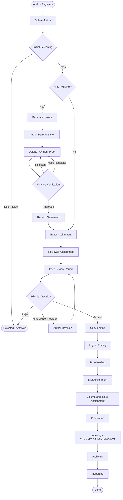
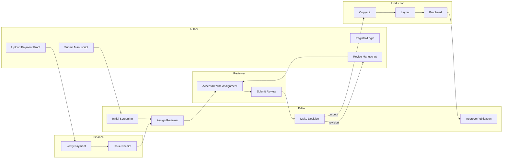
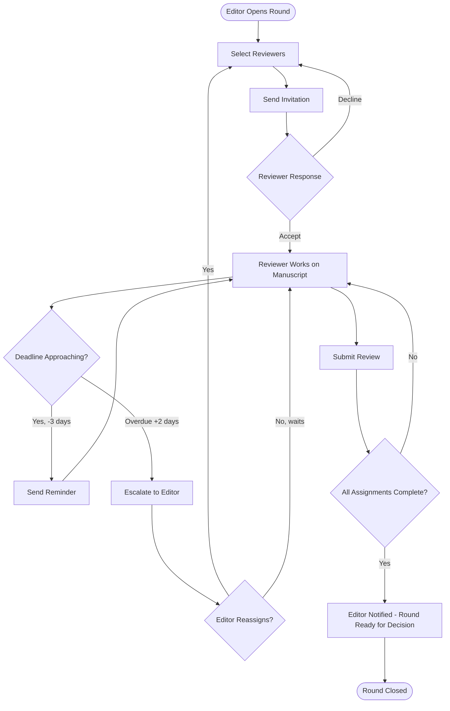
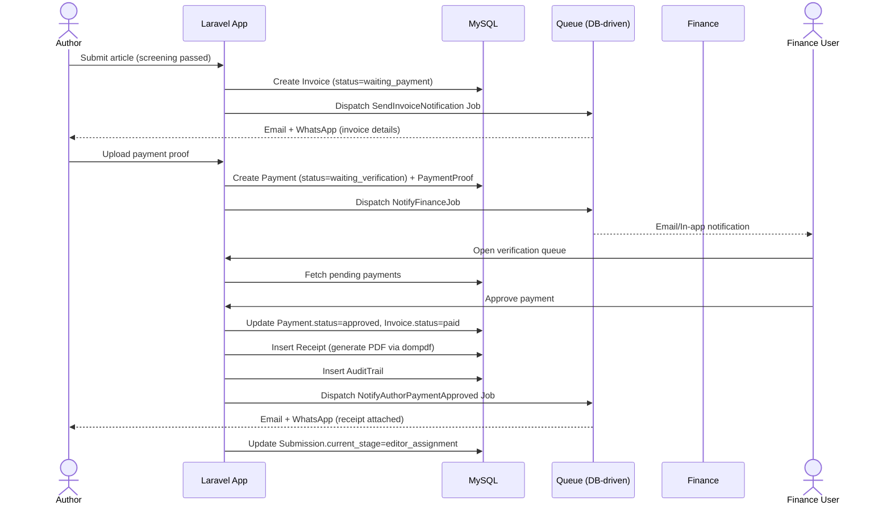
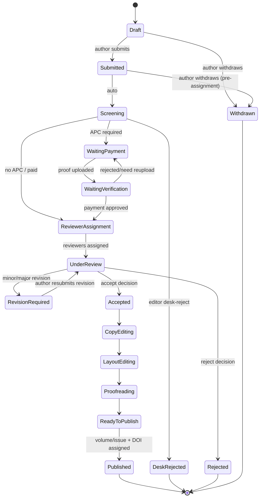
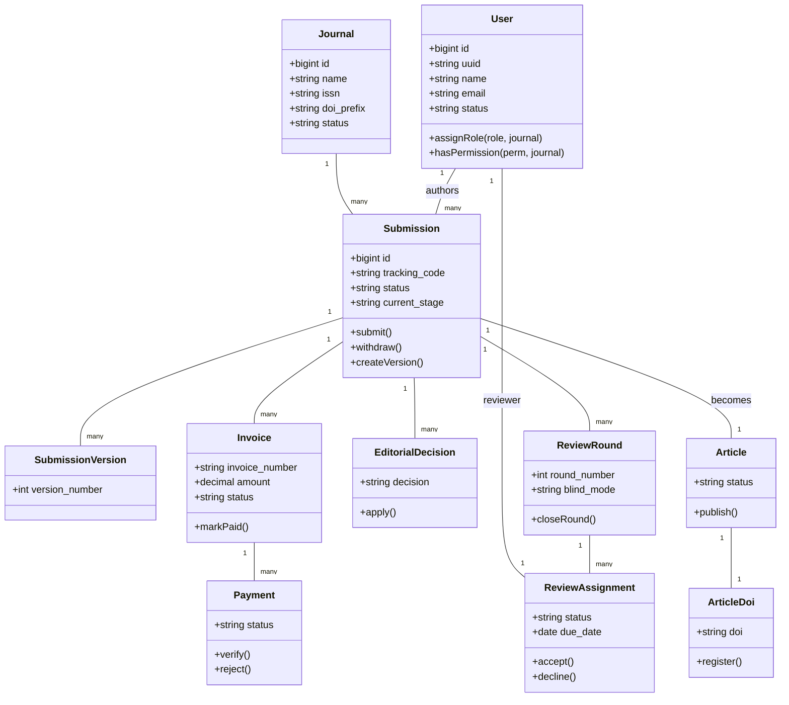

# Chapter 10–17 — Workflow Diagram, BPMN, Use Case Diagram & Specs, Activity, Sequence, State, Class Diagrams

## Introduction
Visual and specification artifacts describing system behavior — used directly by developers to implement controllers/services and by QA to derive test cases.

---

## 10. End-to-End Workflow (BPMN-style)

## 11. BPMN — Swimlane (Actor Responsibility)

## 12. Use Case Diagram

```mermaid
flowchart TB
    Author((Author))
    Reviewer((Reviewer))
    Editor((Editor))
    Finance((Finance))
    Admin((Super/System Admin))
    Publisher((Publisher))
    Reader((Reader/Guest))

    Author --> UC1[Submit Article]
    Author --> UC2[Track Submission]
    Author --> UC3[Upload Payment Proof]
    Author --> UC4[Revise Article]
    Author --> UC5[Download Certificate]

    Reviewer --> UC6[Accept/Decline Review]
    Reviewer --> UC7[Submit Review]

    Editor --> UC8[Screen Submission]
    Editor --> UC9[Assign Reviewer]
    Editor --> UC10[Make Editorial Decision]

    Finance --> UC11[Verify Payment]
    Finance --> UC12[Issue Receipt]
    Finance --> UC13[Apply Waiver/Discount]

    Admin --> UC14[Manage Journal]
    Admin --> UC15[Manage Users/Roles]
    Admin --> UC16[View Audit Trail]

    Publisher --> UC17[Approve Publication]

    Reader --> UC18[Browse/Search Published Article]
    Reader --> UC19[Download Article]
```

## 13. Use Case Specifications (representative set)

### UC-01: Submit Article
- **Actor:** Author
- **Precondition:** Logged in, journal is `active`, no prior mandatory unpaid invoice blocking new submissions (if journal policy requires).
- **Main Flow:**
  1. Author opens "New Submission" wizard.
  2. Step 1: Fill metadata (title, abstract, keywords, language, section).
  3. Step 2: Add authors (self + co-authors), mark corresponding author.
  4. Step 3: Upload manuscript file + optional supplementary/dataset/ethics files.
  5. Step 4: Declare conflict of interest, funding, license.
  6. Step 5: Review & Submit.
  7. System validates (see `01-SRS-FSD-Requirements.md` §D.2), generates `tracking_code`, sets `status=submitted`, `current_stage=screening`.
  8. System fires `SubmissionCreated` event → notifies Author (confirmation) and Journal Manager (new submission alert).
- **Alternate Flow:** Author selects "Save Draft" at any step — validation relaxed, `status=draft`.
- **Postcondition:** Submission visible in Editor's screening queue.
- **Exceptions:** File exceeds size limit → inline error; duplicate title warning → non-blocking confirmation modal.

### UC-03: Upload Payment Proof
- **Actor:** Author
- **Precondition:** Invoice exists with status `waiting_payment`.
- **Main Flow:** Author opens Invoice detail → fills transfer details (bank, date, amount) → uploads proof file → system creates `payments` row (`status=waiting_verification`) and `payment_proofs` row → notifies Finance.
- **Postcondition:** Invoice status stays `waiting_payment` until Finance acts on the `payments` record (design choice: invoice reflects overall billing state, payment reflects a specific transfer attempt — supports partial/multiple transfer attempts).

### UC-07: Submit Review
- **Actor:** Reviewer
- **Precondition:** `review_assignments.status = accepted`.
- **Main Flow:** Reviewer opens review form (rubric per journal config) → scores criteria → writes public/private comments → selects recommendation → submits.
- **Postcondition:** `review_responses` row created, `review_assignments.status = completed`, Editor notified once **all** assignments in the round are completed (or editor manually closes the round early).

### UC-10: Make Editorial Decision
- **Actor:** Managing/Section Editor
- **Precondition:** At least one completed review (or desk-review-only path), round is closed or editor force-closes it.
- **Main Flow:** Editor reviews aggregated recommendations → selects decision → writes comment to author → submits.
- **Postcondition:** `editorial_decisions` row created; state machine (§16) transitions `submissions.current_stage` accordingly; notification sent to Author (and Co-Authors).

### UC-11: Verify Payment
- **Actor:** Finance
- **Precondition:** `payments.status = waiting_verification`.
- **Main Flow:** Finance opens payment queue → reviews proof file + entered details against bank mutation → Approve / Reject / Request Reupload.
  - Approve → `payments.status=approved`, `invoices.status=paid`, `receipts` row auto-generated (PDF via dompdf), Author notified, Submission unblocked to Reviewer Assignment stage.
  - Reject → `payments.status=rejected`, reason required, Author notified, may re-upload (new `payments` row).
  - Need Reupload → `payments.status=need_reupload`, note to Author.
- **Postcondition:** Audit trail entry with Finance user identity.

## 14. Activity Diagram — Peer Review Round

## 15. Sequence Diagram — APC Payment Flow

## 16. State Diagram — Submission Lifecycle

## 17. Class Diagram (core domain models)

## 18–19. Deployment & Component Diagrams
See `02-System-Architecture-Hostinger.md` §6.3–6.4 (kept there to avoid duplication and stay consistent with the adapted Hostinger stack).

---
*Continue to `05-PermissionMatrix-UserStories.md`.*
