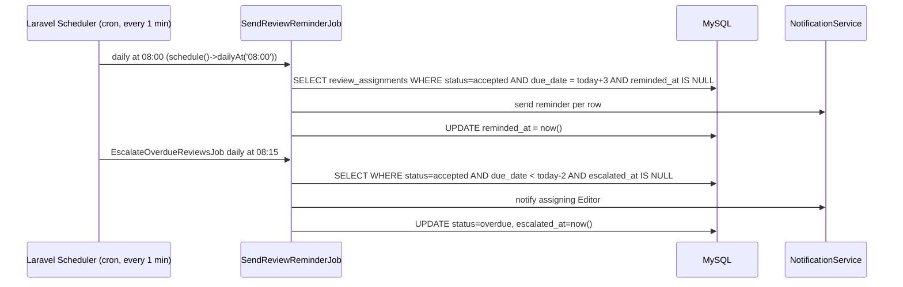
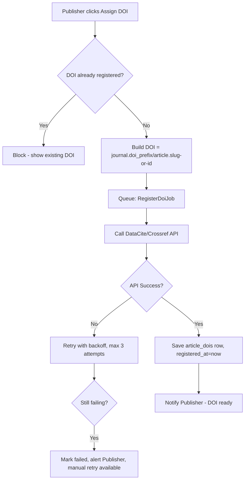

# Chapter 32–34 — Editorial Workflow, Review Workflow, Publication Workflow (Detailed)

## Introduction
Deep-dive operational specification of the three core editorial modules, including role responsibilities, SLAs, escalation logic, and Laravel implementation notes (Events/Listeners/Jobs).

---

## 32. Editorial Workflow

### 32.1 Stages & Responsible Roles

| Stage | Responsible Role | SLA (default, configurable) | System Action on Entry |
|---|---|---|---|
| Initial Screening | Managing/Section Editor | 5 business days | Notify Editor of new submission |
| Reviewer Assignment | Managing/Section Editor | 3 business days after screening pass | — |
| Under Review | Reviewer(s) | per `due_date` (default 14 days) | Reminders/escalation jobs scheduled |
| Editorial Decision | Managing/Section Editor | 5 business days after round closes | Aggregate review summary generated |
| Revision (Author) | Author | 30 days (major) / 14 days (minor), configurable | Reminder at 7 days before deadline |
| Production Sign-off | Managing Editor / Publisher | 7 business days | — |

### 32.2 Decision Matrix

| Decision | Effect | Next Stage |
|---|---|---|
| `desk_reject` | Submission closed at screening, no review consumed | Rejected/Archived |
| `revision_required_before_review` | Author must revise before reviewers assigned | Revision → re-screening |
| `minor_revision` | Author revises with short deadline; typically no new review round required, editor re-checks | Revision → Editor re-check → Accept/Production |
| `major_revision` | Author revises with longer deadline; **new review round** created, may reuse or reassign reviewers | Revision → New Review Round |
| `reject` | Terminal | Rejected/Archived |
| `accept` | Moves to Production | Copyediting |

### 32.3 Implementation Notes (Laravel)
- `EditorialDecisionService::decide(Submission $submission, array $payload): EditorialDecision`
- Fires `EditorialDecisionMade` event → listeners: `NotifyAuthorOfDecision`, `TransitionSubmissionStage`, `LogAuditTrail`.
- `TransitionSubmissionStage` listener is the **single source of truth** for the state machine (mirrors the State Diagram in Ch.04 §16) — implemented as a dedicated `SubmissionStateMachine` class (not scattered `if` statements across controllers) so QA can unit test every transition in isolation.

---

## 33. Review Workflow

### 33.1 Blind Mode Behavior

| Mode | Author sees Reviewer identity? | Reviewer sees Author identity? |
|---|---|---|
| Single Blind | No | Yes |
| Double Blind | No | No (manuscript file must be anonymized — system prompts Author to upload an anonymized version for double-blind journals) |
| Open Review | Yes | Yes |

**Implementation:** `ReviewAssignment` and `ReviewResponse` API Resources apply a `BlindModeTransformer` that strips `reviewer.name`/`reviewer.email` from the payload served to the Author endpoint whenever `review_round.blind_mode != open`. This is enforced at the **API Resource layer**, not just the UI, since API consumers must not leak identity either.

### 33.2 Reviewer Assignment Algorithm (recommended, configurable)
1. Editor manually selects from Reviewer pool **filtered** by: subject expertise tags, current active-assignment count (load balancing), COI (excludes co-authors and same-institution reviewers by default, overridable with warning).
2. System suggests reviewers sorted by: fewest active assignments → best expertise-tag match → best historical on-time completion rate.
3. Minimum reviewers per round: journal-configurable (default 2).

### 33.3 Reminder & Escalation (Scheduled Jobs — cron-driven)



### 33.4 Review Rubric Structure (journal-configurable JSON)
```json
{
  "criteria": [
    { "key": "originality", "label": "Originality", "weight": 25, "scale": 5 },
    { "key": "methodology", "label": "Methodology", "weight": 35, "scale": 5 },
    { "key": "clarity", "label": "Clarity of Writing", "weight": 20, "scale": 5 },
    { "key": "relevance", "label": "Relevance to Journal Scope", "weight": 20, "scale": 5 }
  ]
}
```
Weighted score computed server-side in `ReviewResponse::computedScore()` accessor — never trust client-computed totals.

---

## 34. Publication Workflow

### 34.1 Production Sub-stages

| Sub-stage | Role | Output |
|---|---|---|
| Copyediting | Copy Editor | Copyedited manuscript file; Author acknowledgement |
| Layout Editing | Layout Editor | Galley files: PDF (mandatory), HTML/XML/EPUB (optional per journal) |
| Proofreading | Proofreader | Correction log; final galley approval |
| Publication Approval | Managing Editor / Publisher | Sign-off gate before scheduling |

Each sub-stage is a row in `production_tasks` (`type`, `status`, `assigned_to`, `completed_at`) — publication is blocked until all required sub-stage rows are `completed` (BR-009).

### 34.2 DOI Assignment Flow



Because DOI registration is an **external HTTP call**, it is always queued (`RegisterDoiJob implements ShouldQueue`) — never executed synchronously in the request cycle, both for shared-hosting timeout safety and for resilience against third-party API downtime.

### 34.3 Volume/Issue Assignment
- Publisher/Managing Editor creates or selects a `Volume` (year+number) and `Issue` (number+optional title, e.g., "Special Issue: AI in Agriculture").
- Articles are assigned `issue_id` + `page_start`/`page_end` (page numbers can be auto-suggested sequentially within the issue, editable).
- Issue `status=scheduled` allows a future `publication_date`; a scheduled job (`PublishScheduledIssuesJob`, runs hourly via cron) flips `status=published` and all contained articles to `status=published` at the scheduled date/time, then fires `IssuePublished` event → triggers indexing export jobs (OAI-PMH cache rebuild, Crossmark metadata push).

### 34.4 Format Generation Notes (Shared-hosting constraint)
- **PDF**: generated via `barryvdh/laravel-dompdf` from a Blade template — pure-PHP, no headless browser needed, safe for shared hosting.
- **HTML**: rendered directly from stored structured content (if journal enables XML-first authoring) or as a styled wrapper around the PDF-source Blade template.
- **XML** (JATS-like): generated via a structured template mapping submission metadata + body sections to XML nodes (`spatie/laravel-xml` or manual `SimpleXMLElement` builder) — advisable to keep as a Phase 4 feature (Crossref/DOAJ often accept metadata-only XML separate from full-text JATS).
- **EPUB**: lowest priority; can be generated via a pure-PHP EPUB library (e.g., `PHPePub`) since Calibre/pandoc binaries are typically unavailable on shared hosting.

---
*Continue to `08-Payment-Finance-Module.md`.*
