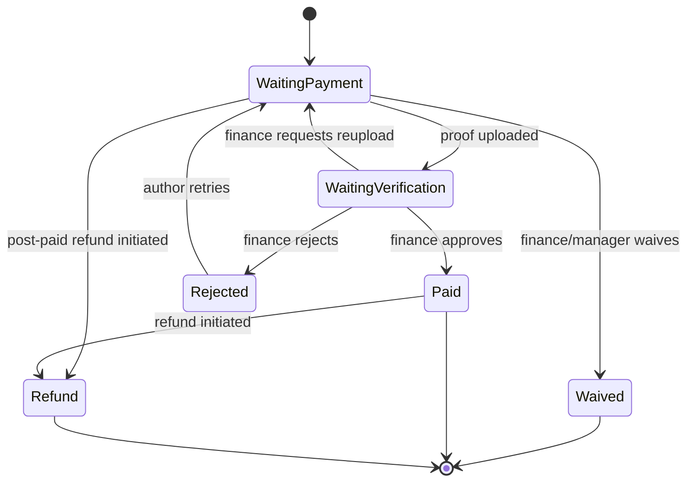

# Chapter 31, 35 — Finance Flow, Payment Workflow (Manual Transfer Only)

## Introduction
Complete specification of the Finance module. **No payment gateway** is integrated — 100% manual bank-transfer based, per project requirement.

## Objectives
Ensure every rupiah collected is traceable to a Submission, an Invoice, an uploaded proof, and a verifying human, with full audit trail — suitable for university/publisher financial audits.

---

## 31.1 Finance Module Entities Recap
`invoices`, `payments`, `payment_proofs`, `receipts`, `refunds`, `bank_accounts`, `apc_fees` (see full dictionary in `03-Database-Design-ERD-Dictionary.md`).

## 31.2 Invoice Generation Rules
- Trigger: Submission passes Initial Screening AND `journal.apc_default_amount > 0` (or a section-specific override) AND no active waiver applies.
- `invoice_number` format: `INV/{journal_code}/{yyyy}/{sequence}` — sequence reset yearly per journal, generated inside a DB transaction with `SELECT ... FOR UPDATE` on a per-journal counter row to avoid race conditions under concurrent submissions (important since shared hosting has limited concurrency headroom — keep the lock window minimal).
- `due_date` = `created_at + journal.invoice_due_days` (default 14).
- Multiple bank accounts per journal supported; invoice displays **all active** accounts, author chooses which to use (recorded in `payments.bank_name` matching one of them, validated against `bank_accounts` list — free text allowed with a warning if it doesn't match any registered account, to accommodate edge cases).

## 31.3 Payment Status State Machine

Note: `Invoice.status` tracks the **billing** state (`waiting_payment`, `waiting_verification`, `paid`, `rejected`, `waived`, `refunded`); `Payment.status` tracks each individual **transfer attempt** (an author may have multiple failed attempts before one succeeds — all retained for audit, not overwritten).

## 31.4 Verification SOP (for Finance role)
1. Open Payment Verification queue (sorted oldest-first, SLA countdown badge shown).
2. Cross-check: `amount_transferred` vs `invoice.amount - discount_amount`; `transfer_date` plausibility; proof file legibility.
3. Optional: cross-reference against journal's actual bank mutation (manual, outside system) before approving — the system does not auto-reconcile bank statements (no gateway/Open Banking integration in scope).
4. Action:
   - **Approve** → `payments.status=approved`, `payments.verified_by`, `verified_at`; `invoices.status=paid`; `receipts` row + PDF auto-generated (queued job `GenerateReceiptJob`); Author notified (Email+WhatsApp); Submission unblocked (`current_stage` advances to Editor/Reviewer Assignment).
   - **Reject** → `payments.status=rejected`, `rejection_reason` required (min 10 chars); Author notified with reason; Author may submit a new payment attempt against the same invoice.
   - **Need Reupload** → `payments.status=need_reupload`; a softer variant of reject (e.g., "image blurry, please re-upload clearer proof") — same notification path, different tone/template.
5. Every action → `audit_trails` row (module=`Finance`, action=`payment_verified`, `old_values`/`new_values` capturing status transition).

## 31.5 Waiver & Discount Rules
- Waiver = 100% of `invoice.amount` forgiven; Discount = partial (`discount_amount` or `discount_percent`).
- Per BR-011, waivers and discounts above threshold require secondary approval (`approved_by` field populated, cannot be self-approved by the same Finance user who created the waiver record — enforced via Policy `WaiverPolicy::approve()` checking `waiver.created_by != auth()->id()` when role = Finance; Journal Manager/System Admin may self-approve).
- Common waiver reasons (dropdown + free text): Editorial Invitation, Indexed Partner Agreement, Institutional MOU, Financial Hardship, Promotional Campaign.

## 31.6 Refund Workflow (bookkeeping only, no gateway payout)
1. Finance creates a `refunds` record referencing the `payment_id`, amount, method (e.g., "Manual Bank Transfer Out"), reference number.
2. Requires Journal Manager approval if `amount > invoice.amount * 50%` (configurable threshold, mirrors waiver rule pattern).
3. Refund does **not** automatically revert `invoices.status`; Finance explicitly sets the resulting invoice status (`refunded`) — since real-world refund reasons vary (full article withdrawal vs. partial adjustment) and should not be auto-inferred.

## 31.7 Receipt Generation
- PDF via `barryvdh/laravel-dompdf` from a Blade template including: journal letterhead/logo, invoice number, receipt number, author name, article title, amount, payment date, verifying Finance officer name, digital signature block (QR code linking to a public verification URL `/verify-receipt/{uuid}` showing a minimal authenticity confirmation page — implemented with `simplesoftwareio/simple-qrcode`).
- Stored at `storage/app/receipts/{journal_slug}/{year}/{receipt_number}.pdf`, served via signed temporary URL, never a public static path.

## 31.8 Finance Dashboard Widgets (see also Ch.09 Dashboard Spec)
- Outstanding invoices count/amount (aging buckets: 0–7d, 8–14d, 15–30d, 30d+)
- Today's verification queue count
- Monthly revenue trend (chart)
- Waiver/discount total (transparency metric)

## 31.9 Financial Report Fields (for Reporting module, Ch.09)
`journal, invoice_number, submission_tracking_code, author_name, amount, discount, status, paid_at, verified_by, receipt_number` — exportable Excel/CSV/PDF, filterable by date range and journal, generated via queued job for large ranges (NFR-PERF-03).

---
*Continue to `09-CMS-Reporting-Dashboard.md`.*
