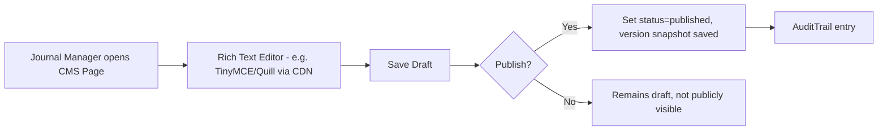
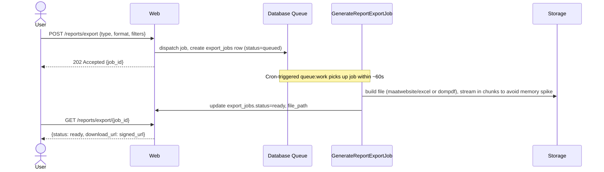

# Chapter 36–38 + UI/UX — CMS Workflow, Reporting Module, Dashboard Specification, Screen Specs

## Introduction
Covers the public-facing CMS, internal reporting engine, dashboard widgets per role, and representative UI/UX screen specifications (Bootstrap 5 + AlpineJS, responsive).

---

## 36. CMS Module

### 36.1 Manageable Content Types (per Journal)

| Content Type | Fields | Notes |
|---|---|---|
| Landing Page | hero banner, blocks (rich text/image), CTA | Drag-reorderable blocks (AlpineJS `x-sort` or simple up/down buttons for shared-hosting simplicity — avoid heavy JS bundlers) |
| About | rich text | |
| Editorial Team | list of {user, role_title, order} | Pulls from `journal_user` + display override |
| Reviewer List | list of {user, expertise_tags} | Optional public visibility toggle |
| Focus & Scope | rich text | |
| Announcements | title, body, publish_at, expire_at | |
| News | title, body, cover_image, publish_at | |
| Contact | address, email, phone, map embed | |
| FAQ | list of {question, answer, order} | |
| Publication Ethics | rich text | Often COPE-aligned template |
| Author Guideline | rich text + downloadable template files | |
| Reviewer Guideline | rich text | |
| Publication Fee | rich text + auto-pulled `apc_default_amount` | |
| Template Download | file list {title, file, category} | |
| Editorial Policies | rich text | |
| Privacy Policy / Terms | rich text | Global default + per-journal override |
| SEO | meta title/description/OG image per page | |
| Banner | image, link, order, active_from/to | Homepage carousel |
| Menu | hierarchical {label, url/route, order, parent_id} | |
| Footer | columns of links + social icons | |

### 36.2 CMS Editing Flow

All CMS content is versioned (each save creates a `cms_page_versions` snapshot row) enabling rollback — inexpensive on shared hosting since content is text, not media-heavy.

---

## 37. Reporting Module

### 37.1 Report Catalog

| Report | Key Metrics | Filters |
|---|---|---|
| Submission Report | total, by status, by section, trend over time | journal, date range |
| Publication Report | articles published, by issue | journal, date range |
| Acceptance Rate | accepted/(accepted+rejected) % | journal, date range, section |
| Reviewer Performance | avg turnaround days, on-time %, avg score given | journal, reviewer |
| Editor Performance | avg time-to-decision, decisions breakdown | journal, editor |
| Revenue | total collected, by journal, by month | journal, date range |
| Outstanding Payment | unpaid invoices aging | journal |
| Payment Report | all payment transactions | journal, status, date range |
| Invoice Report | all invoices with status | journal, date range |
| Author Report | submissions per author/institution | journal |
| Institution Report | submissions/publications per institution | — |
| Journal Report | cross-journal comparison (Super Admin only) | date range |
| Audit Report | audit trail extract | module, user, date range |
| Activity Report | activity log extract | user, date range |

### 37.2 Export Architecture (Shared-Hosting Safe)

Large exports MUST use chunked queries (`chunkById`) to keep memory under shared-hosting PHP memory_limit.

---

## 38. Dashboard Specification (per role — widget list)

| Role | Dashboard Widgets |
|---|---|
| Super Admin | System-wide journal count, active users, storage usage, queue health (pending/failed jobs), audit trail feed |
| Journal Manager | Submissions this month, pending screening, revenue this month, upcoming issue schedule |
| Managing/Section Editor | My screening queue, reviews awaiting my decision, overdue reviews needing escalation |
| Reviewer | My active assignments (due-date sorted), completed review history |
| Finance | Verification queue count, outstanding invoices aging chart, monthly revenue trend |
| Author | My submissions timeline, invoices/payments status, notifications |
| Publisher | Articles ready to publish, DOI registration failures needing retry |

All widgets built as reusable Blade components (`<x-dashboard.widget-card>`) fed by cached Eloquent aggregate queries (`Cache::remember('dashboard.journal.'.$id, 300, fn() => ...)` — database cache driver, 5-minute TTL, acceptable staleness for dashboard summary numbers on shared hosting).

---

## UI/UX Screen Specifications (representative)

### Screen: Author — Submission Wizard
- **Type:** Multi-step wizard (5 steps), Bootstrap 5 `nav-pills` + AlpineJS `x-data="{step:1}"` for client-side step control, final submit posts to API.
- **States:** Loading (skeleton on file upload), Empty (no co-authors yet — "Add Author" prompt), Error (inline field errors from 422 response), Validation (live keyword counter, file-size guard before upload starts).
- **Responsive:** Stepper collapses to a progress bar + step label on mobile (`<576px`).

### Screen: Editor — Screening Queue (Table)
- **Type:** Data table with server-side pagination, column sort, status filter chips.
- **Columns:** Tracking Code, Title, Author, Submitted Date, Days in Queue (badge — red if > SLA), Action button.
- **Empty State:** "No submissions awaiting screening" illustration + link to full submission list.
- **Responsive:** Table converts to stacked cards below 768px (Bootstrap 5 `table-responsive` + custom card fallback).

### Screen: Finance — Payment Verification (Split View)
- **Type:** Left panel = queue list; right panel = detail (invoice info + proof image viewer with zoom + action buttons Approve/Reject/Reupload).
- **Modal:** Rejection reason modal (required textarea, min-length validation before submit enabled).
- **Loading State:** Skeleton loaders on proof image while fetching signed URL.

### Screen: Public — Article Detail Page
- **Type:** Two-column (metadata + abstract left, download/cite/metrics card right — sticky on desktop, stacked on mobile).
- **Components:** Citation export dropdown (BibTeX/RIS/EndNote), DOI badge (links to `doi.org`), view/download counters, related articles carousel.
- **SEO:** Server-rendered Blade (not SPA) for crawlability; JSON-LD `ScholarlyArticle` schema embedded.

### Screen: Reviewer — Review Form
- **Type:** Wizard/accordion: Section 1 rubric criteria (sliders/radio per criterion), Section 2 comments (public/private tabs), Section 3 recommendation + file attachment.
- **Validation:** Public comment required before submit enabled; recommendation required; unsaved-changes browser warning (`beforeunload`).

### Global UI Standards
- Design tokens: Bootstrap 5 default palette customized per-journal via `theme_color` CSS variable injection (`:root { --bs-primary: {{ $journal->theme_color }}; }`).
- Forms: label-above-input, inline validation messages, disabled-until-valid submit buttons for destructive/financial actions.
- Buttons: primary (solid), secondary (outline), destructive (red, requires confirm modal for Delete/Reject/Withdraw actions).
- Loading state: Bootstrap spinner + skeleton placeholders for list/detail views.
- Error state: toast (AlpineJS + Bootstrap Toast component) for transient errors; full-page error component for 403/404/500.

---
*Continue to `10-Security-Audit-Notification.md`.*
