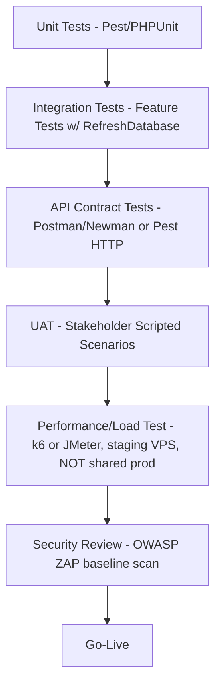

# Chapter 39–43 — Testing Strategy, Unit, Integration, UAT, Performance Testing

## Introduction
Defines the QA approach ensuring the platform is production-ready given both enterprise correctness requirements and shared-hosting resource constraints.

## Objectives
Catch defects early (unit), verify module interaction (integration), validate business acceptance (UAT), and confirm the app behaves within shared-hosting performance limits (performance/load testing done off the production host).

---

## 39. Testing Strategy Overview

Testing pyramid emphasis: **heavy unit + feature test coverage** (cheap, fast, run in CI), **light UI/browser test coverage** (Laravel Dusk is resource-heavy — run only smoke scenarios, and never on shared hosting itself, only in a CI runner/staging VPS).

## 40. Unit Testing
- Framework: **Pest** (preferred, built on PHPUnit) for readability.
- Target ≥ 80% coverage on: Services, Actions, State Machine (`SubmissionStateMachine`), Policies, validation rule objects.
- Example test targets:
  - `SubmissionStateMachineTest`: every legal transition succeeds; every illegal transition throws `InvalidStateTransitionException`.
  - `InvoiceServiceTest`: invoice number sequence uniqueness under concurrent creation (mock DB lock).
  - `ReviewResponseTest`: weighted rubric score computed correctly against known input/output pairs.
  - `BlindModeTransformerTest`: reviewer identity stripped correctly per each blind mode.

## 41. Integration Testing (Feature Tests)
- Laravel `RefreshDatabase` trait + SQLite in-memory OR MySQL test DB (recommend MySQL to catch dialect-specific issues since production is MySQL).
- Scenarios:
  - Full submission → screening → invoice → payment → verification → reviewer assignment happy path (single feature test asserting each DB state transition).
  - Unauthorized role attempting a protected action → `403`.
  - File upload with disallowed MIME → `422`.
  - Queue-dependent flows tested with `Queue::fake()` + explicit assertion the correct Job was dispatched (not the job's internal logic, which is unit-tested separately).
  - Notification dispatch tested with `Notification::fake()`.

## 42. UAT (User Acceptance Testing)
- Conducted by actual stakeholder proxies (Journal Manager, Editor, Author, Finance representatives) in a **staging environment mirroring production Hostinger config** (same PHP version, same `database` queue/cache drivers) to catch shared-hosting-specific surprises before go-live.
- UAT script derived directly from User Stories' Acceptance Criteria (Ch.05) — each AC becomes a manual test step with Pass/Fail sign-off.
- Sample UAT Scenario Sheet:

| Scenario | Steps | Expected Result | Pass/Fail |
|---|---|---|---|
| Author submits and pays APC | Register → Submit → Receive Invoice → Upload Proof → Finance Approves | Submission unblocked to Reviewer Assignment; Receipt downloadable | |
| Double-blind review hides identity | Assign 2 reviewers, double-blind journal | Author cannot see reviewer name anywhere in UI/API | |
| Overdue reviewer escalation | Set due_date to yesterday, run scheduler | Editor receives escalation notification | |

## 43. Performance Testing
- **Do NOT load-test the live shared-hosting production account** — Hostinger shared plans throttle/suspend accounts exceeding resource fair-use; instead:
  1. Provision an equivalent-spec **staging VPS** (same PHP 8.4, MySQL, `database` cache/queue drivers) purely for load testing.
  2. Tool: **k6** or **JMeter** simulating realistic concurrent user counts (e.g., 50–100 concurrent for a mid-size journal portfolio).
  3. Key metrics: p95 response time < 2s for read endpoints, queue drain time (jobs processed within one cron cycle under normal load), DB query count per request (target < 20 queries per page via eager loading — audit with Laravel Telescope/Debugbar in staging only, disabled in production).
  4. Validate the **cron-based queue worker** keeps pace: simulate a burst of 500 queued notification jobs and confirm the 1-minute cron cycle drains the backlog within an acceptable window (document actual measured throughput for capacity planning).
- Database: verify indexes (Ch.03) actually get used via `EXPLAIN` on the top 10 slowest queries identified during load test.

## Test Environments

| Environment | Purpose | Config |
|---|---|---|
| Local (Dev) | Development | Laravel Sail/Herd, SQLite or local MySQL, `queue=sync` for fast iteration |
| CI (GitHub Actions or similar) | Automated unit/feature tests on every push | MySQL service container, `queue=sync` |
| Staging (VPS or Hostinger Cloud) | UAT + performance testing | Mirrors production config exactly (`database` queue/cache, cron worker) |
| Production (Hostinger) | Live | As specified in Ch.02/Ch.12 |

## Defect Severity Classification

| Severity | Definition | SLA to Fix |
|---|---|---|
| Critical | Data loss, security breach, payment miscalculation | Immediate hotfix |
| High | Core workflow blocked (e.g., cannot submit) | Within 24h |
| Medium | Non-blocking functional bug, workaround exists | Within sprint |
| Low | Cosmetic/UI polish | Backlog |

---
*Continue to `12-Deployment-DevOps-Hostinger.md`.*
