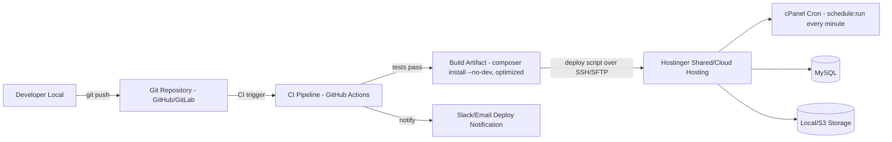

# Chapter 44–48 — Deployment Guide, Backup & Recovery, Disaster Recovery, DevOps Architecture, CI/CD Pipeline

## Introduction
Step-by-step operational guide for running this Laravel 12 application on **Hostinger shared/cloud hosting** — explicitly without Redis, without Nginx, without SSH daemons/Supervisor.

---

## 44. Deployment Guide (Hostinger Shared/Cloud Hosting)

### 44.1 Prerequisites
- Hostinger **Business** or **Cloud** hosting plan (Premium plan is too limited for cron/DB connection headroom).
- PHP 8.4 selected in cPanel → "Select PHP Version", with extensions enabled: `pdo_mysql, mbstring, openssl, curl, gd/imagick, zip, fileinfo, bcmath, intl, xml, ctype, json, tokenizer`.
- SSH access enabled (Hostinger provides SSH on Business/Cloud plans) — required to run `composer install` and `artisan` commands; if SSH is unavailable, use cPanel's "Terminal" feature or a Softaculous/Composer-in-cPanel tool as fallback.
- A MySQL database + user created via cPanel "MySQL Databases".

### 44.2 Folder Structure on Hostinger
Laravel's `public/` must be the web-accessible root, while the rest of the app (`.env`, `app/`, `config/`, etc.) must stay **outside** the public webroot for security.

**Recommended layout:**
```
/home/USERNAME/
 ├─ ojs-app/                  <- Laravel root (composer.json, app/, .env, etc.) — NOT web-accessible
 └─ domains/yourjournal.com/public_html/   <- Hostinger's web-accessible document root
      ├─ index.php            <- MODIFIED to point to ../../ojs-app/
      ├─ .htaccess             <- copied from ojs-app/public/.htaccess
      └─ (other public/ assets, or symlinked)
```
**Steps:**
1. Upload/clone the full Laravel app to `~/ojs-app/` (outside `public_html`).
2. Copy `ojs-app/public/*` into `public_html/` (or symlink individual asset folders if disk quota is a concern).
3. Edit `public_html/index.php`: change the two `require` paths:
   ```php
   require __DIR__.'/../../ojs-app/vendor/autoload.php';
   $app = require_once __DIR__.'/../../ojs-app/bootstrap/app.php';
   ```
4. Run `composer install --no-dev --optimize-autoloader` inside `ojs-app/` via SSH.
5. Copy `.env.example` → `.env`, fill production values (DB, MAIL, FONNTE_API_KEY, APP_URL, `QUEUE_CONNECTION=database`, `CACHE_STORE=database`, `SESSION_DRIVER=database`, `FILESYSTEM_DISK=local`).
6. `php artisan key:generate`
7. `php artisan migrate --force`
8. `php artisan db:seed --force` (roles/permissions/system settings)
9. `php artisan storage:link` (symlink `storage/app/public` → `public/storage`; verify the symlink target resolves correctly given the split folder structure above — may need a manual `ln -s` via SSH if Hostinger's symlink handling differs)
10. `php artisan config:cache && php artisan route:cache && php artisan view:cache`
11. Set up the **Cron Job** (cPanel → Cron Jobs):
    ```
    * * * * * cd /home/USERNAME/ojs-app && php artisan schedule:run >> /dev/null 2>&1
    ```
12. Force SSL: enable Hostinger AutoSSL for the domain; confirm `.htaccess` HTTPS redirect is active.
13. Smoke test: visit the domain, register a test account, submit a test journal/article end-to-end.

### 44.3 Scheduler-Driven Queue Worker (replacing Supervisor)
Inside `routes/console.php` (Laravel 12 style) or `App\Console\Kernel::schedule()`:
```php
$schedule->command('queue:work --stop-when-empty --max-time=50 --tries=3')
    ->everyMinute()
    ->withoutOverlapping()
    ->runInBackground();
```
This makes the 1-minute cron effectively act as a "always-on" worker without ever exceeding shared-hosting's disallowance of long-running daemons — each invocation drains the queue for up to 50 seconds then exits cleanly before the next cron tick.

---

## 45. Backup & Recovery

| Item | Method | Frequency | Retention |
|---|---|---|---|
| Database | `mysqldump` via cron script → compressed → stored in a non-public directory, optionally pushed to S3/Google Drive via `rclone` (SSH-available on Hostinger) | Daily | 30 days rolling + 12 monthly snapshots |
| File Storage (`storage/app`) | `tar.gz` incremental via cron (or Hostinger's built-in "Backups" feature in hPanel if on a plan that includes it) | Daily | 30 days rolling |
| Full-account snapshot | Hostinger native backup (hPanel → Backups) if included in plan | Weekly (or as included) | Per plan's retention |
| Off-site copy | S3 bucket (already wired via `.env` toggle) or external storage via `rclone`/cron | Daily | 90 days |

**Backup script skeleton (cron, daily 02:00):**
```bash
#!/bin/bash
TS=$(date +%Y%m%d)
mysqldump -u DBUSER -pDBPASS DBNAME | gzip > /home/USERNAME/backups/db_$TS.sql.gz
tar -czf /home/USERNAME/backups/storage_$TS.tar.gz -C /home/USERNAME/ojs-app/storage/app .
find /home/USERNAME/backups -mtime +30 -delete
```

## 46. Disaster Recovery (DR)

| Scenario | Recovery Procedure | RTO Target | RPO Target |
|---|---|---|---|
| Accidental data deletion | Restore latest `mysqldump` to a fresh DB, replay any available binlog/audit trail for reconciliation | 4 hours | 24 hours |
| Full hosting account compromise/loss | Re-provision new Hostinger account or VPS, restore from off-site S3 backup, re-point DNS | 24 hours | 24 hours |
| Corrupted deployment (bad release) | `php artisan down`, redeploy previous Git tag/release, `php artisan up` | 30 minutes | 0 (no data loss, code-only rollback) |
| Storage disk failure (shared hosting side) | Escalate to Hostinger support (managed infra); restore files from own off-site backup meanwhile | Per Hostinger SLA + own restore | 24 hours |

DR runbook must be stored **outside** the production server (e.g., in the private Git repo's `docs/` folder and a shared drive) so it's accessible even if the server itself is unreachable.

## 47. DevOps Architecture (Shared-Hosting Adapted)



Since Hostinger shared hosting has no Docker/container runtime, "DevOps" here means: **Git-based deployment + CI-run automated tests + SSH/SFTP-based release script**, not container orchestration.

## 48. CI/CD Pipeline (GitHub Actions example)

```yaml
name: OJS CI/CD
on:
  push:
    branches: [main]
jobs:
  test:
    runs-on: ubuntu-latest
    services:
      mysql:
        image: mysql:8.0
        env: { MYSQL_DATABASE: ojs_test, MYSQL_ROOT_PASSWORD: root }
        ports: ["3306:3306"]
    steps:
      - uses: actions/checkout@v4
      - uses: shivammathur/setup-php@v2
        with: { php-version: '8.4', extensions: mbstring, pdo_mysql, bcmath, intl }
      - run: composer install --prefer-dist --no-progress
      - run: cp .env.testing .env
      - run: php artisan key:generate
      - run: php artisan migrate --force
      - run: ./vendor/bin/pest --coverage --min=80

  deploy:
    needs: test
    if: github.ref == 'refs/heads/main'
    runs-on: ubuntu-latest
    steps:
      - uses: actions/checkout@v4
      - name: Deploy via SFTP/SSH
        uses: easingthemes/ssh-deploy@main
        with:
          SSH_PRIVATE_KEY: ${{ secrets.HOSTINGER_SSH_KEY }}
          REMOTE_HOST: ${{ secrets.HOSTINGER_HOST }}
          REMOTE_USER: ${{ secrets.HOSTINGER_USER }}
          SOURCE: "./"
          TARGET: "/home/USERNAME/ojs-app/"
          EXCLUDE: "/.git/, /node_modules/, /tests/"
      - name: Post-deploy artisan commands
        run: |
          ssh ${{ secrets.HOSTINGER_USER }}@${{ secrets.HOSTINGER_HOST }} \
          "cd /home/USERNAME/ojs-app && composer install --no-dev --optimize-autoloader && \
           php artisan migrate --force && \
           php artisan config:cache && php artisan route:cache && php artisan view:cache && \
           php artisan queue:restart"
```
`queue:restart` is still meaningful even under the cron-worker model: it sets a restart signal timestamp so the next cron-triggered `queue:work` cycle picks up new code instead of continuing to run stale cached bootstrapped code from a previous long `--max-time=50` run.

## 49. Infrastructure Recommendation Summary
See also `02-System-Architecture-Hostinger.md` §6.7. Recap:
- **Now (Phase 1–4):** Hostinger Business/Cloud shared hosting — sufficient for low-to-mid traffic multi-journal deployments (a few hundred concurrent users).
- **Growth trigger:** if queue backlog regularly exceeds one cron cycle's drain capacity, or MySQL connection limits are frequently hit → migrate to Hostinger **VPS** (or any VPS/cloud) where Redis + Supervisor + Nginx can be enabled with **zero application code changes** (only `.env` + a proper Supervisor config replacing the cron-worker trick).

---
*Continue to `13-Future-Enhancement.md`.*
